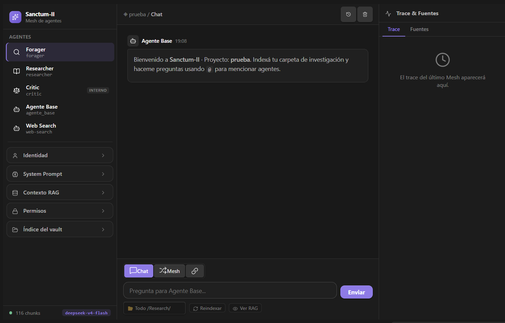
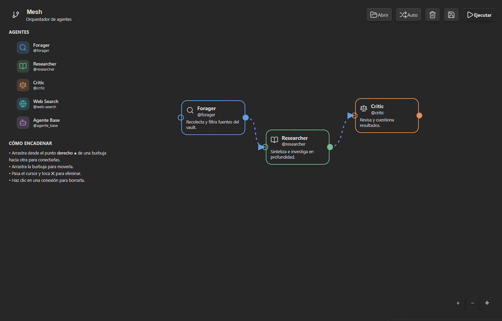
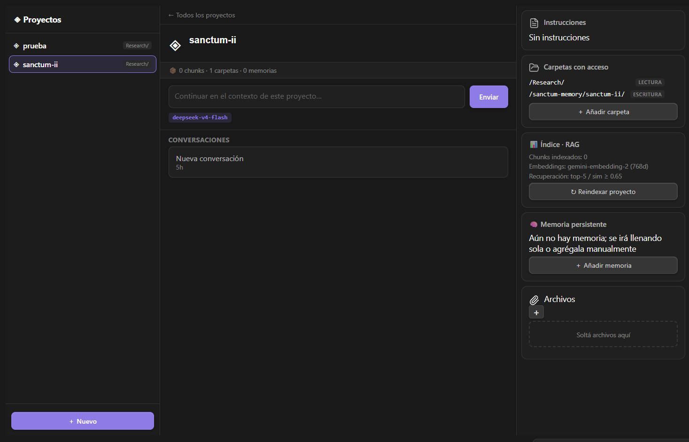

<a id="readme-top"></a>

<div align="center">
  <a href="https://github.com/Abraham2106/Sanctum-II">
    
  </a>

  <h1>Sanctum II</h1>

  <p>
    Plataforma local-first de agentes de IA para investigar, organizar y convertir un vault de Obsidian en conocimiento reutilizable.
  </p>

  <p>
    <a href="https://github.com/Abraham2106/Sanctum-II/actions/workflows/ci.yml"></a>
    <a href="https://github.com/Abraham2106/Sanctum-II/releases"></a>
    <a href="LICENSE"></a>
    
    
    
  </p>

  <p>
    <a href="#inicio-rápido"><strong>Inicio rápido</strong></a>
    ·
    <a href="docs/registro-arquitectura.md"><strong>Arquitectura</strong></a>
    ·
    <a href="mcp-server/README.md"><strong>Servidor MCP</strong></a>
    ·
    <a href="https://github.com/Abraham2106/Sanctum-II/issues"><strong>Issues</strong></a>
  </p>
</div>

> [!IMPORTANT]
> Sanctum II está en desarrollo activo (`v0.1.0`) y funciona únicamente en Obsidian Desktop. Antes de usarlo con información sensible, revisa la sección de [seguridad y privacidad](#seguridad-y-privacidad).

## Visión general

Sanctum II integra chat, recuperación semántica, agentes especializados, proyectos aislados y escritura controlada de notas dentro de Obsidian. El contenido y el estado operativo permanecen en el vault: proyectos, threads, memoria, índices, trazas, agentes, skills y cadenas se almacenan como Markdown o JSONL inspeccionable.

La plataforma ofrece dos superficies sobre el mismo conocimiento:

- **Plugin de Obsidian:** experiencia visual para conversar, investigar, administrar proyectos, explorar el Knowledge Graph y diseñar cadenas de agentes.
- **Servidor MCP standalone:** proceso Node sobre `stdio` que permite consultar el vault e invocar agentes desde VS Code, OpenCode y otros clientes compatibles, incluso sin Obsidian abierto.

## Capacidades principales

| Área | Capacidad |
|---|---|
| **Chat contextual** | Conversaciones persistentes, resumen progresivo, menciones `@agente` y continuidad al crear notas desde una investigación previa. |
| **RAG por proyecto** | Índices vectoriales independientes, filtros por `read_paths`, manifiesto incremental y reindexado total o parcial. |
| **Mesh de investigación** | Pipeline Forager → Researcher ↔ Critic con evaluación, feedback, regeneración y escalado. |
| **Proyectos** | Threads, memoria, archivos adjuntos, instrucciones, rutas de lectura/escritura y carpeta de salida propias. |
| **Knowledge Graph** | Relaciones por wikilinks, similitud semántica y refuerzo de conexiones. |
| **Notas accionables** | Creación y actualización de Markdown con permisos fail-closed y registro de la ruta realmente escrita. |
| **Agentes y skills** | Definiciones declarativas en Markdown con frontmatter, herramientas y permisos explícitos. |
| **Cadenas visuales** | Composición y ejecución de flujos dirigidos de agentes desde Obsidian. |
| **MCP** | Cinco tools para listar agentes, leer notas, consultar RAG, invocar agentes y ejecutar el mesh. |
| **Observabilidad** | Trazas JSON con origen, agente, duración, uso y estado de la ejecución. |

## Capturas

### Chat y agentes



### Mesh de investigación



### Proyectos, memoria y threads



## Cómo funciona

```text
Usuario / cliente MCP
        │
        ├── Chat directo ──► ChatOrchestrator ──► agente + skill
        │                                           │
        ├── Mesh ──────────► Forager ─► Researcher ◄┤
        │                                  │        │
        │                               Critic ─────┘
        │
        └── Contexto del proyecto
              ├── read_paths / write_paths
              ├── VectorStore + manifiesto
              ├── Knowledge Graph
              ├── memoria + thread + resumen
              └── salida Markdown
```

El flujo general de una consulta es:

1. Capturar un snapshot del proyecto, thread, agente, skill e índices activos.
2. Resolver confirmaciones o acciones pendientes de la conversación.
3. Aplicar permisos y filtros de rutas.
4. Recuperar contexto RAG y, cuando corresponde, contexto web.
5. Ejecutar el agente o el mesh.
6. Persistir resumen, acciones pendientes, notas creadas y trazas.

Consulta [registro-arquitectura.md](docs/registro-arquitectura.md) y [arquitectura-uml.md](docs/arquitectura-uml.md) para una descripción más detallada.

## Inicio rápido

### Requisitos

- Obsidian Desktop `1.0.0+`.
- Node.js `22` recomendado y npm.
- Una API key compatible con OpenCode para las respuestas LLM.
- Una o más API keys de Gemini para embeddings y RAG.
- Opcionalmente, una API key de Tavily para búsqueda web.

### 1. Clonar e instalar

```bash
git clone https://github.com/Abraham2106/Sanctum-II.git
cd Sanctum-II
npm install
```

### 2. Configurar credenciales

Las credenciales pueden configurarse desde **Settings → Sanctum II** o mediante un archivo `.env` basado en `.env.example`:

```env
OPENCODE_GO_API_KEY=sk-tu-api-key
OPENCODE_GO_BASE_URL=https://api.opencode.ai
GEMINI_API_KEYS=AIza-key-1,AIza-key-2
TAVILY_API_KEY=tvly-tu-api-key
```

`TAVILY_API_KEY` es opcional. Sin ella, las funciones de búsqueda web se omiten y el resto del flujo continúa disponible.

> [!CAUTION]
> No publiques `.env`, keys reales ni configuraciones MCP con secretos embebidos. Prefiere variables del entorno del sistema.

### 3. Compilar

```bash
npm run build
```

El build produce:

- `main.js`, bundle del plugin de Obsidian.
- `mcp-server/dist/index.cjs`, servidor MCP standalone.

### 4. Instalar en un vault

Crea `.obsidian/plugins/sanctum-ii/` dentro del vault y copia:

```text
main.js
manifest.json
styles.css
```

Copia también los directorios `sanctum-agents/` y `sanctum-skills/` en la raíz del vault. Después, recarga Obsidian y habilita **Sanctum II** en **Settings → Community plugins**.

En Windows puedes usar:

```powershell
npm run deploy
```

Antes de ejecutarlo, cambia la variable `$vault` al inicio de `deploy.ps1`; el script incluido apunta al vault local de desarrollo y no es portable sin esa modificación.

## Primer uso

1. Abre **Proyectos** desde el ribbon de Obsidian.
2. Crea o selecciona un proyecto.
3. Configura sus `read_paths`, `write_paths` y carpeta de salida.
4. Indexa el proyecto desde la vista o desde la paleta de comandos.
5. Abre el chat y consulta el contenido indexado.

Ejemplos:

```text
@researcher Investiga QAOA, Ising y QUBO /deep-research

Crea una nota en el vault con el contenido de la investigación

@mi-cadena Analiza estas fuentes y prepara una revisión crítica
```

Cuando un agente ofrece guardar una investigación, Sanctum conserva el contenido fuente como una acción pendiente. Una confirmación posterior puede reformatearlo como nota autónoma sin perder fórmulas, referencias ni contexto.

## Proyectos y almacenamiento

Cada proyecto mantiene su propio perímetro de contexto y persistencia:

| Ruta | Contenido |
|---|---|
| `sanctum-projects/{projectId}.md` | Configuración, permisos, modelo e instrucciones del proyecto. |
| `sanctum-logs/index/{projectId}/vector-store.jsonl` | Chunks y embeddings del índice vectorial. |
| `sanctum-logs/index/{projectId}/manifest.json` | Estado incremental de archivos indexados. |
| `sanctum-logs/threads/{projectId}/` | Threads, mensajes, resúmenes y acciones pendientes. |
| `sanctum-memory/{projectId}/memory.jsonl` | Memoria persistente del proyecto. |
| `Projects/{projectId}/` | Notas generadas para el proyecto. |
| `sanctum-logs/traces/` | Trazas del plugin y del servidor MCP. |

La indexación por proyecto:

- valida que las carpetas solicitadas pertenezcan a `read_paths`;
- serializa solicitudes concurrentes por proyecto;
- conserva otras carpetas durante un reindexado parcial;
- elimina del índice archivos borrados durante un reindexado completo;
- inicia vacío, sin tratar la ausencia del primer índice como error.

## Agentes y skills

Los agentes viven en `sanctum-agents/*.md` y las skills en `sanctum-skills/*.md`. Ambos usan frontmatter declarativo.

### Agentes incluidos

| ID | Rol |
|---|---|
| `agente_base` | Chat general, RAG y acciones sobre notas. |
| `forager` | Recolección y reformulación de contexto. |
| `researcher` | Investigación extensa con fuentes internas y web. |
| `critic` | Evaluación estructurada y feedback del mesh. |
| `web-search` | Consulta web y síntesis contextual. |
| `orchestrator` | Clasificación de intención para mensajes implícitos. |

### Skill incluida

| ID | Herramientas | Propósito |
|---|---|---|
| `deep-research` | `rag_query`, `web_search`, `create_note` | Investigación profunda, contrastada y con referencias. |

Ejemplo mínimo de agente:

```markdown
---
id: reviewer
name: "Reviewer"
model: "deepseek-v4-flash"
tools: [rag_query]
permissions:
  read_paths: ["/Research/**"]
  write_paths: []
---
Revisa críticamente el material recuperado.

{{rag_context}}
{{user_prompt}}
```

## Servidor MCP

El servidor MCP se ejecuta como un proceso Node independiente y se comunica mediante JSON-RPC 2.0 sobre `stdio`. `stdout` queda reservado para el protocolo; los logs estructurados se escriben exclusivamente en `stderr`.

### Tools disponibles

| Tool | Dependencia | Función |
|---|---|---|
| `sanctum_list_agents` | Ninguna | Lista agentes fijos y personalizados. |
| `sanctum_get_note` | Agente válido | Lee una nota aplicando sus `read_paths`. |
| `sanctum_query_vault` | Gemini | Ejecuta búsqueda semántica sobre el índice. |
| `sanctum_invoke_agent` | OpenCode | Invoca un agente individual. |
| `sanctum_run_mesh` | OpenCode | Ejecuta Forager → Researcher → Critic. |

Configuración mínima para VS Code (`.vscode/mcp.json`):

```jsonc
{
  "servers": {
    "sanctum-ii": {
      "command": "node",
      "args": ["${workspaceFolder}/mcp-server/dist/index.cjs"],
      "env": {
        "SANCTUM_VAULT_PATH": "C:/ruta/al/vault",
        "GEMINI_API_KEYS": "${env:GEMINI_API_KEYS}",
        "OPENCODE_GO_API_KEY": "${env:OPENCODE_GO_API_KEY}",
        "OPENCODE_GO_BASE_URL": "${env:OPENCODE_GO_BASE_URL}"
      }
    }
  }
}
```

Documentación completa: [mcp-server/README.md](mcp-server/README.md). Especificación y decisiones: [Sanctum-II-MCP-Server.md](docs/Sanctum-II-MCP-Server.md).

## Seguridad y privacidad

Sanctum II aplica permisos en dos capas:

- **Proyecto:** `read_paths` y `write_paths` delimitan el contexto y los destinos válidos.
- **Agente:** cada definición declara las rutas y herramientas que puede utilizar.

Las listas de permisos vacías son **fail-closed**. El adaptador filesystem del MCP también rechaza:

- rutas absolutas y segmentos `..`;
- null bytes;
- acceso a `.env`, `.git`, `.obsidian` y `node_modules`;
- rutas que escapen del vault mediante resolución o symlinks.

Los archivos, índices y trazas se almacenan localmente. Sin embargo, al usar proveedores externos, los prompts y el contexto necesario para responder se envían a las APIs configuradas de OpenCode, Gemini o Tavily. Revisa sus políticas antes de procesar material confidencial.

## Desarrollo y calidad

| Comando | Descripción |
|---|---|
| `npm run dev` | Compila plugin y MCP en modo watch. |
| `npm run typecheck` | Ejecuta TypeScript sin emitir archivos. |
| `npm test` | Ejecuta la suite Vitest. |
| `npm run build` | Genera los bundles de producción. |
| `npm run mcp:smoke` | Comprueba protocolo, tools, permisos y errores MCP. |
| `npm run verify` | Ejecuta typecheck, tests, build y smoke test. |

La integración continua vive en `.github/workflows/ci.yml` y ejecuta `npm run verify` en pushes y pull requests.

## Estructura del repositorio

```text
Sanctum-II/
├── src/
│   ├── app/             # Servicios y orquestación del chat
│   ├── agents/          # Carga y tipos de agentes
│   ├── orchestrator/    # Turnos, conversación, mesh y notas
│   ├── projects/        # Proyectos, threads, memoria e indexación
│   ├── rag/             # VectorStore persistente
│   ├── kg/              # Knowledge Graph
│   ├── chains/          # Persistencia y ejecución de cadenas
│   ├── skills/          # Skills declarativas
│   ├── core/            # Filesystem, escritura, comandos y entorno
│   └── ui/              # Vistas y componentes de Obsidian
├── mcp-server/          # Servidor MCP standalone y smoke tests
├── sanctum-agents/      # Agentes incluidos
├── sanctum-skills/      # Skills incluidas
├── docs/                # Arquitectura, especificaciones y capturas
└── .github/workflows/   # CI
```

## Estado y roadmap

Implementado:

- [x] Chat multiagente con RAG y continuidad de conversación.
- [x] Mesh Forager → Researcher ↔ Critic.
- [x] Proyectos con índices, memoria y threads aislados.
- [x] Knowledge Graph explícito y semántico.
- [x] Creación y actualización controlada de notas.
- [x] Skills, agentes personalizados y cadenas visuales.
- [x] Servidor MCP standalone con cinco tools.
- [x] Suite automatizada, smoke tests y CI.

Próximos pasos:

- [ ] Estabilizar contratos públicos y migraciones de datos.
- [ ] Ampliar cobertura de pruebas end-to-end dentro de Obsidian.
- [ ] Preparar distribución para Community Plugins.
- [ ] Documentación y experiencia completa en inglés.

## Contribuir

1. Crea un fork del repositorio.
2. Abre una rama descriptiva: `git checkout -b feature/nombre`.
3. Implementa el cambio y ejecuta `npm run verify`.
4. Crea un commit claro y abre un Pull Request.

Para cambios arquitectónicos, incluye la motivación, los límites de compatibilidad y las pruebas que protegen el nuevo comportamiento.

## Licencia

Distribuido bajo la licencia MIT. Consulta [LICENSE](LICENSE).

## Créditos

Sanctum II se construye sobre [Obsidian](https://obsidian.md), [TypeScript](https://www.typescriptlang.org), [esbuild](https://esbuild.github.io), [Google Gemini](https://ai.google.dev), [OpenCode](https://opencode.ai) y [Tavily](https://tavily.com).

<p align="right"><a href="#readme-top">Volver arriba ↑</a></p>
