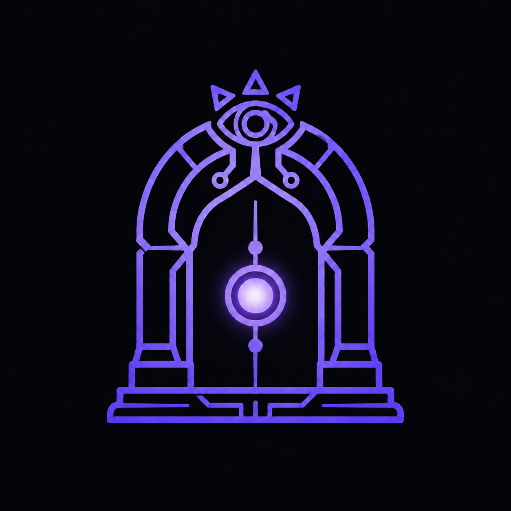

<!-- Improved compatibility of back to top link: See: https://github.com/othneildrew/Best-README-Template/pull/73 -->
<a id="readme-top"></a>

<!--
*** Sanctum II — README profesional en español.
*** Basado en Best-README-Template (othneildrew).
*** Próximas versiones incluirán traducción al inglés.
-->


<!-- PROJECT SHIELDS -->
[![Contributors][contributors-shield]][contributors-url]
[![Forks][forks-shield]][forks-url]
[![Stargazers][stars-shield]][stars-url]
[![Issues][issues-shield]][issues-url]
[![MIT License][license-shield]][license-url]
[![Release][release-shield]][release-url]


<!-- PROJECT LOGO -->
<br />
<div align="center">
  <a href="https://github.com/Abraham2106/Sanctum-II">
    
  </a>

  <h3 align="center">Sanctum II</h3>

  <p align="center">
    Plugin de Obsidian con mesh de agentes de IA que investigan, razonan y escriben sobre tu vault.
    <br />
    <a href="docs/registro-arquitectura.md"><strong>Explorar la documentación »</strong></a>
    <br />
    <br />
    <a href="https://github.com/Abraham2106/Sanctum-II/issues/new?labels=bug&template=bug-report---.md">Reportar Bug</a>
    &middot;
    <a href="https://github.com/Abraham2106/Sanctum-II/issues/new?labels=enhancement&template=feature-request---.md">Solicitar Feature</a>
  </p>
</div>


<!-- TABLE OF CONTENTS -->
<details>
  <summary>Tabla de contenidos</summary>
  <ol>
    <li>
      <a href="#acerca-del-proyecto">Acerca del proyecto</a>
      <ul>
        <li><a href="#construido-con">Construido con</a></li>
      </ul>
    </li>
    <li>
      <a href="#empezar">Empezar</a>
      <ul>
        <li><a href="#prerrequisitos">Prerrequisitos</a></li>
        <li><a href="#instalación">Instalación</a></li>
      </ul>
    </li>
    <li><a href="#uso">Uso</a></li>
    <li><a href="#arquitectura">Arquitectura</a></li>
    <li><a href="#agentes-y-habilidades">Agentes y habilidades</a></li>
    <li><a href="#roadmap">Roadmap</a></li>
    <li><a href="#contribuir">Contribuir</a></li>
    <li><a href="#licencia">Licencia</a></li>
    <li><a href="#contacto">Contacto</a></li>
    <li><a href="#reconocimientos">Reconocimientos</a></li>
  </ol>
</details>


<!-- ABOUT THE PROJECT -->
## Acerca del proyecto

[![Sanctum II Chat][product-screenshot]](https://github.com/Abraham2106/Sanctum-II)

**Sanctum II** es un plugin de Obsidian diseñado para convertir tu vault en un laboratorio de inteligencia artificial autocontenido. En lugar de depender de interfaces externas, los agentes viven dentro de Obsidian, leen tus notas, generan respuestas con fuentes, y crean nuevo conocimiento directamente en Markdown.

El corazón del sistema es un **orquestador con loop de investigación-crítica-regeneración**:

```
Usuario escribe una pregunta
  └─ 🔍 Forager — reformula el prompt con contexto RAG del vault
       └─ 📚 Researcher — produce investigación (hasta 3 intentos)
            └─ ⚖️ Critic — evalúa con 5 criterios (score threshold: 80/100)
                 ├─ Score ≥ 80 → ACCEPT → devuelve resultado
                 └─ Score < 80 → feedback → Researcher regenera
                                      └─ si ≥ 3 intentos → ESCALATE al usuario
```

### ¿Por qué Sanctum II?

* Tu conocimiento permanece en tu vault: los agentes razonan sobre tus propias notas.
* Resultados verificables: cada afirmación se cita con `[[wikilink]]` o referencias web.
* Extensible: agentes, skills y cadenas se definen en archivos Markdown dentro del vault.
* Transparente: cada ejecución se registra en `sanctum-logs/traces/` con historial, scores y tokens.

<p align="right">(<a href="#readme-top">volver arriba</a>)</p>


### Construido con

* [![TypeScript][typescript-shield]][typescript-url]
* [![Obsidian][obsidian-shield]][obsidian-url]
* [![esbuild][esbuild-shield]][esbuild-url]
* [![Gemini][gemini-shield]][gemini-url]
* [![OpenCode][opencode-shield]][opencode-url]
* [![Tavily][tavily-shield]][tavily-url]

<p align="right">(<a href="#readme-top">volver arriba</a>)</p>


<!-- GETTING STARTED -->
## Empezar

Sigue estos pasos para ejecutar Sanctum II en tu vault local.

### Prerrequisitos

* **Obsidian v1.7+** (escritorio, `isDesktopOnly: true`).
* **Node.js v20+** y npm.
* Una **API key de [OpenCode](https://opencode.ai)** (`OPENCODE_GO_API_KEY`).
* Al menos una **API key de Gemini** (`GEMINI_API_KEYS`) para embeddings.
* *(Opcional)* Una **API key de [Tavily](https://tavily.com)** para búsqueda web.

### Instalación

1. Clona el repositorio
   ```sh
   git clone https://github.com/Abraham2106/Sanctum-II.git
   ```
2. Instala las dependencias
   ```sh
   npm install
   ```
3. Copia y configura las variables de entorno
   ```sh
   cp .env.example .env
   ```
   Edita `.env`:
   ```env
   OPENCODE_GO_API_KEY=sk-tu-api-key-aqui
   OPENCODE_GO_BASE_URL=https://api.opencode.ai
   GEMINI_API_KEYS=AIza...,AIza...,AIza...
   TAVILY_API_KEY=tvly-tu-api-key-aqui
   ```
4. Compila el plugin
   ```sh
   npm run build
   ```
5. Despliega en tu vault de Obsidian
   ```sh
   npm run deploy
   ```
   > `deploy.ps1` copia `main.js`, `manifest.json`, `styles.css`, los agentes y skills al directorio `.obsidian/plugins/sanctum-ii/` y crea las carpetas necesarias.
6. Recarga Obsidian (`Ctrl+R`) y habilita **Sanctum II** en Settings → Community plugins.

<p align="right">(<a href="#readme-top">volver arriba</a>)</p>


<!-- USAGE EXAMPLES -->
## Uso

### Chat con agentes

1. Haz clic en el icono 🤖 de la barra lateral para abrir el chat.
2. Escribe `@` para ver el autocompletado de agentes y notas del vault.
3. Selecciona `@agente_base` o cualquier agente personalizado.

[![Sanctum II Chat][chat-screenshot]](https://github.com/Abraham2106/Sanctum-II)

### Modo Mesh (investigación con crítica)

1. Indexa `/Research/` con el botón 📚 **Indexar**.
2. Activa el modo 🔀 **Mesh**.
3. Pregunta algo como:
   > _"Crea una nota llamada Quantum sobre computación cuántica"_

Sanctum II ejecutará el pipeline `Forager → Researcher ↔ Critic` y, si el veredicto es positivo, creará la nota en tu vault con etiquetas semánticas.

[![Sanctum II Mesh][mesh-screenshot]](https://github.com/Abraham2106/Sanctum-II)

### Proyectos y memoria

Organiza tu conocimiento en proyectos con RAG aislado, threads persistentes y memoria asociada.

[![Sanctum II Proyectos][projects-screenshot]](https://github.com/Abraham2106/Sanctum-II)

### Comandos disponibles

| Comando | Atajo / Acceso | Descripción |
|---|---|---|
| Abrir chat de Sanctum II | Ribbon icon 🤖 | Abre la vista de chat |
| Abrir Knowledge Graph | Ribbon icon 🔀 | Visualiza conexiones entre notas |
| Abrir Proyectos | Ribbon icon 📁 | Gestiona proyectos y threads |
| Abrir Orquestador de Cadenas | Ribbon icon ⛓️ | Crea flujos visuales de agentes |
| Probar embeddings | Command palette | Valida la conexión con Gemini |
| Indexar `/Research/` | Command palette / Settings | Genera el índice RAG |
| Ejecutar mesh | Command palette | Lanza Forager→Researcher↔Critic |

<p align="right">(<a href="#readme-top">volver arriba</a>)</p>


<!-- ARCHITECTURE -->
## Arquitectura

```
src/
├── main.ts                    # Plugin lifecycle + thin delegation
├── constants.ts               # View types, settings, defaults
├── utils.ts                   # Utilidades generales
├── agents/
│   ├── types.ts               # AgentDefinition interface
│   ├── agent-loader.ts        # Parseo de agentes .md
│   └── fallback.ts            # Agente por defecto
├── app/
│   ├── services.ts            # Contenedor central de dependencias (DI)
│   ├── chat-orchestrator.ts   # Orquestador de chat directo
│   └── mesh-orchestrator.ts   # Orquestador del loop Forager→Researcher↔Critic
├── chains/
│   ├── types.ts               # Chain, ChainNode, ChainEdge
│   ├── store.ts               # Persistencia de cadenas
│   └── executor.ts            # Ejecución de flujos visuales
├── chat/                      # (reservado) utilidades de mensajería
├── core/
│   ├── commands.ts            # Comandos del plugin
│   ├── env-loader.ts          # Variables de entorno
│   ├── note-writer.ts         # Crear/actualizar notas del vault
│   └── tests.ts               # Helpers de prueba
├── embeddings/
│   └── gemini-balancer.ts     # Rotación de keys + embeddings
├── kg/
│   ├── types.ts               # KgEdge, KgOptions
│   ├── kg.ts                  # Cálculo de aristas
│   ├── kg-store.ts            # Persistencia del grafo
│   ├── layout.ts              # Layout del grafo
│   └── native-links.ts        # Integración con wikilinks de Obsidian
├── llm/
│   └── opencode-client.ts     # Cliente OpenAI-compatible
├── orchestrator/
│   ├── agent-turn.ts          # RAG → render → chat pipeline
│   ├── conversation.ts        # Clasificación de intenciones
│   ├── mesh.ts                # Loop Forager→Researcher↔Critic
│   └── note-generator.ts      # Ejecución de intenciones de escritura
├── permissions/               # (reservado) reglas de permisos
├── projects/
│   ├── types.ts               # Project, Thread, MemoryEntry
│   ├── store.ts               # Persistencia de proyectos
│   ├── context.ts             # Contexto de proyecto
│   └── indexer.ts             # Indexado por proyecto
├── rag/
│   ├── vector-store.ts        # Almacén vectorial JSONL + Base64
│   └── indexer.ts             # Chunk + embed + store
├── skills/
│   ├── types.ts               # Skill interface
│   └── loader.ts              # Carga de skills .md
├── tools/
│   └── tavily.ts              # Búsqueda web
├── ui/
│   ├── chat-view.ts           # Vista principal de chat
│   ├── chat-*.ts              # Componentes del chat (autocomplete, mensajes, composer, etc.)
│   ├── settings-tab.ts        # Panel de configuración
│   ├── kg-view.ts             # Vista de Knowledge Graph
│   ├── projects-view.ts       # Vista de proyectos
│   ├── chain-view.ts          # Vista del orquestador de cadenas
│   └── agent-generator-modal.ts # Modal para crear agentes
└── observability/
    └── tracer.ts              # Grabación de traces
```

<p align="right">(<a href="#readme-top">volver arriba</a>)</p>


<!-- AGENTS & SKILLS -->
## Agentes y habilidades

### Agentes del sistema

| Agente | ID | Avatar | Rol |
|---|---|---|---|
| Agente Base | `agente_base` | 🤖 | Chat directo con RAG y escritura de notas |
| Forager | `forager` | 🔍 | Reformula prompts con contexto del vault |
| Researcher | `researcher` | 📚 | Produce investigación combinando RAG + web |
| Critic | `critic` | ⚖️ | Evalúa con 5 criterios (interno, no aparece en `@`) |
| Web Search | `web-search` | 🌐 | Búsqueda web + síntesis con el índice |

### Habilidades (Skills)

| Skill | ID | Herramientas | Descripción |
|---|---|---|---|
| Deep Research | `deep-research` | `rag_query`, `web_search`, `create_note` | Investigación profunda multi-fuente con síntesis |

Los agentes y skills se definen en archivos Markdown dentro de `sanctum-agents/` y `sanctum-skills/`, respectivamente, con frontmatter declarativo.

<p align="right">(<a href="#readme-top">volver arriba</a>)</p>


<!-- ROADMAP -->
## Roadmap

- [x] Mesh Forager → Researcher ↔ Critic con regeneración automática
- [x] RAG con embeddings Gemini y vector store JSONL
- [x] @mention autocomplete (agentes + notas)
- [x] Creación de notas con IA y `#tags` semánticos
- [x] Knowledge Graph (explícito + semántico + reforzado)
- [x] Proyectos con memoria, threads y RAG aislado
- [x] Orquestador visual de cadenas de agentes
- [x] Skills declarativos (`deep-research`)
- [x] Traces completos en `sanctum-logs/traces/`
- [ ] Soporte multi-idioma (inglés)
- [ ] Tests automatizados (jest/vitest)
- [ ] CI/CD con GitHub Actions
- [ ] Publicación en Community Plugins de Obsidian
- [ ] Tooling adicional: recordatorios, tareas y calendario

Consulta los [issues abiertos](https://github.com/Abraham2106/Sanctum-II/issues) para ver la lista completa de features propuestas y bugs conocidos.

<p align="right">(<a href="#readme-top">volver arriba</a>)</p>


<!-- CONTRIBUTING -->
## Contribuir

Las contribuciones son lo que hace grande a la comunidad open source. Cualquier aporte es **muy apreciado**.

1. Haz fork del proyecto
2. Crea tu rama de feature (`git checkout -b feature/FeatureAsombrosa`)
3. Commit tus cambios (`git commit -m 'Add some FeatureAsombrosa'`)
4. Push a la rama (`git push origin feature/FeatureAsombrosa`)
5. Abre un Pull Request

### Contribuidores principales

<a href="https://github.com/Abraham2106/Sanctum-II/graphs/contributors">
  
</a>

<p align="right">(<a href="#readme-top">volver arriba</a>)</p>


<!-- LICENSE -->
## Licencia

Distribuido bajo la licencia MIT. Consulta `LICENSE` para más información.

<p align="right">(<a href="#readme-top">volver arriba</a>)</p>


<!-- CONTACT -->
## Contacto

Abraham2106 — [https://github.com/Abraham2106](https://github.com/Abraham2106)

Link del proyecto: [https://github.com/Abraham2106/Sanctum-II](https://github.com/Abraham2106/Sanctum-II)

<p align="right">(<a href="#readme-top">volver arriba</a>)</p>


<!-- ACKNOWLEDGMENTS -->
## Reconocimientos

* [Obsidian.md](https://obsidian.md) — la plataforma que hace posible este plugin.
* [OpenCode](https://opencode.ai) — API de chat utilizada por los agentes.
* [Google Gemini](https://ai.google.dev) — embeddings para RAG.
* [Tavily](https://tavily.com) — búsqueda web para agentes de investigación.
* [esbuild](https://esbuild.github.io) — bundler rápido para el plugin.
* [Best-README-Template](https://github.com/othneildrew/Best-README-Template) — plantilla base para este README.

<p align="right">(<a href="#readme-top">volver arriba</a>)</p>


<!-- MARKDOWN LINKS & IMAGES -->
<!-- https://www.markdownguide.org/basic-syntax/#reference-style-links -->

<!-- Repository -->
[contributors-shield]: https://img.shields.io/github/contributors/Abraham2106/Sanctum-II.svg?style=for-the-badge
[contributors-url]: https://github.com/Abraham2106/Sanctum-II/graphs/contributors
[forks-shield]: https://img.shields.io/github/forks/Abraham2106/Sanctum-II.svg?style=for-the-badge
[forks-url]: https://github.com/Abraham2106/Sanctum-II/network/members
[stars-shield]: https://img.shields.io/github/stars/Abraham2106/Sanctum-II.svg?style=for-the-badge
[stars-url]: https://github.com/Abraham2106/Sanctum-II/stargazers
[issues-shield]: https://img.shields.io/github/issues/Abraham2106/Sanctum-II.svg?style=for-the-badge
[issues-url]: https://github.com/Abraham2106/Sanctum-II/issues
[license-shield]: https://img.shields.io/github/license/Abraham2106/Sanctum-II.svg?style=for-the-badge
[license-url]: https://github.com/Abraham2106/Sanctum-II/blob/master/LICENSE
[release-shield]: https://img.shields.io/github/v/release/Abraham2106/Sanctum-II?style=for-the-badge
[release-url]: https://github.com/Abraham2106/Sanctum-II/releases

<!-- Screenshots -->
[product-screenshot]: docs/MVP-Chat.png
[chat-screenshot]: docs/MVP-Chat.png
[mesh-screenshot]: docs/MVP-Mesh.png
[projects-screenshot]: docs/MVP-Proyectos.png

<!-- Tech stack -->
[typescript-shield]: https://img.shields.io/badge/TypeScript-3178C6?style=for-the-badge&logo=typescript&logoColor=white
[typescript-url]: https://www.typescriptlang.org/
[obsidian-shield]: https://img.shields.io/badge/Obsidian-7C3AED?style=for-the-badge&logo=obsidian&logoColor=white
[obsidian-url]: https://obsidian.md
[esbuild-shield]: https://img.shields.io/badge/esbuild-FFCF00?style=for-the-badge&logo=esbuild&logoColor=black
[esbuild-url]: https://esbuild.github.io
[gemini-shield]: https://img.shields.io/badge/Gemini-8E75B2?style=for-the-badge&logo=googlegemini&logoColor=white
[gemini-url]: https://ai.google.dev
[opencode-shield]: https://img.shields.io/badge/OpenCode-000000?style=for-the-badge&logo=opencode&logoColor=white
[opencode-url]: https://opencode.ai
[tavily-shield]: https://img.shields.io/badge/Tavily-FF6B6B?style=for-the-badge&logo=tavily&logoColor=white
[tavily-url]: https://tavily.com
