# Sanctum II — Documentación UML de Arquitectura

> **Plugin de Obsidian** — AI Agent Mesh con RAG, Knowledge Graph, y Orquestación de Cadenas  
> **Versión:** 0.1.0 | **Lenguaje:** TypeScript | **Build:** esbuild → CJS

---

## Índice

1. [Diagrama de Paquetes (Package Diagram)](#1-diagrama-de-paquetes-package-diagram)
2. [Diagrama de Clases (Class Diagram)](#2-diagrama-de-clases-class-diagram)
3. [Diagrama de Componentes (Component Diagram)](#3-diagrama-de-componentes-component-diagram)
4. [Diagrama de Secuencia — Flujo de Chat](#4-diagrama-de-secuencia--flujo-de-chat)
5. [Diagrama de Secuencia — Mesh con Crítico](#5-diagrama-de-secuencia--mesh-con-crítico)
6. [Diagrama de Secuencia — Ejecución de Cadenas](#6-diagrama-de-secuencia--ejecución-de-cadenas)
7. [Diagrama de Estados — Ciclo Mesh](#7-diagrama-de-estados--ciclo-mesh)
8. [Diagrama Entidad-Relación (ER)](#8-diagrama-entidad-relación-er)
9. [Diagrama de Despliegue (Deployment)](#9-diagrama-de-despliegue-deployment)

---

## 1. Diagrama de Paquetes (Package Diagram)

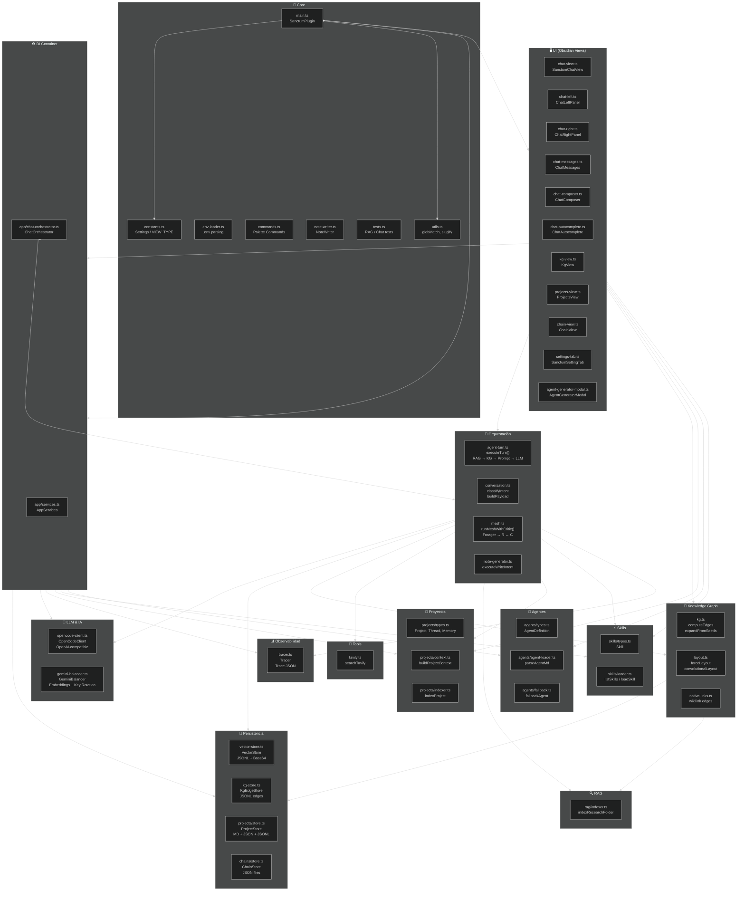

---

## 2. Diagrama de Clases (Class Diagram)

### 2.1 Clases Principales del Plugin

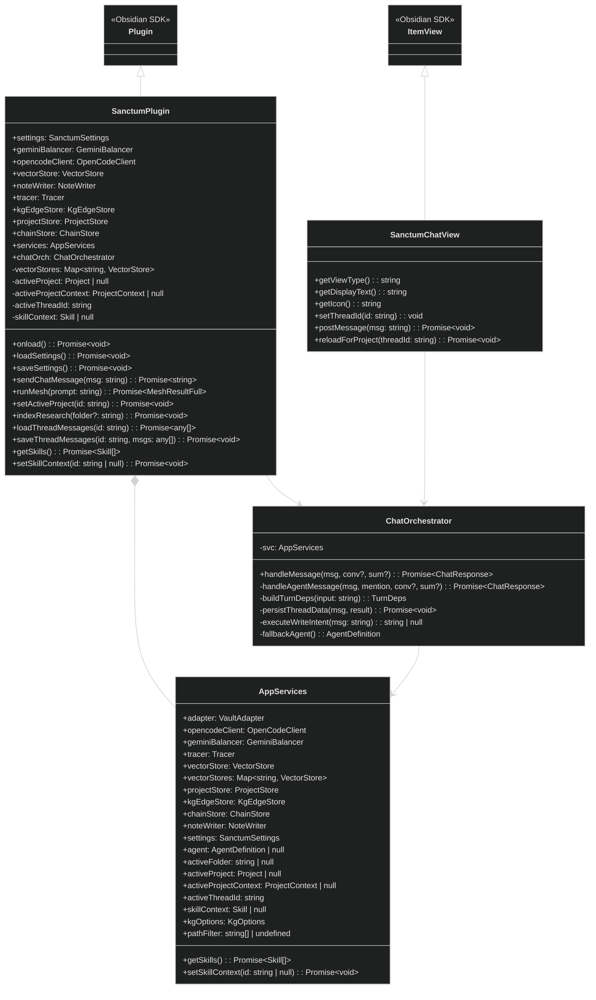

### 2.2 Servicios de Datos y LLM

```mermaid
%%{init: {'theme': 'dark', 'themeVariables': { 'fontSize': '13px' }}}%%
classDiagram
    class VectorStore {
        +storePath: string
        +allChunks: Chunk[]
        +count: number
        +load(adapter: VaultAdapter): Promise~void~
        +save(adapter: VaultAdapter): Promise~void~
        +add(chunk: Chunk): void
        +clear(): void
        +search(embedding: number[], k: number): ScoredChunk[]
        +filterByPaths(results, patterns): ScoredChunk[]
        +getStorePath(): string
    }

    class Chunk {
        +id: string
        +note_path: string
        +chunk_text: string
        +embedding: number[]
        +chunk_index: number
        +total_chunks: number
    }

    VectorStore *-- Chunk

    class GeminiBalancer {
        +modelNames: string[]
        +hasKeys: boolean
        +embed(text: string): Promise~number[]~
        -embedWithKey(key: string, model: string, text: string): Promise~number[]~
    }

    class OpenCodeClient {
        +configured: boolean
        +chat(systemPrompt, userPrompt, rag?): Promise~LLMResponse~
        +chat(messages: ConversationMessage[]): Promise~LLMResponse~
    }

    class NoteWriter {
        +create(path: string, content: string): Promise~WriteResult~
        +update(path: string, content: string): Promise~WriteResult~
        +append(path: string, content: string): Promise~WriteResult~
        +replace(path: string, oldStr: string, newStr: string): Promise~WriteResult~
    }

    class KgEdgeStore {
        +edges: KgEdge[]
        +count: number
        +load(adapter: VaultAdapter): Promise~void~
        +save(adapter: VaultAdapter): Promise~void~
        +add(edge: KgEdge): void
        +setEdges(notePath: string, edges: KgEdge[]): void
        +getEdgesFor(notePath: string): KgEdge[]
        +delAllEdgesForNote(notePath: string): void
    }

    class ProjectStore {
        -adapter: VaultAdapter
        +loadProject(id: string): Promise~Project~
        +saveProject(project: Project): Promise~void~
        +projectExists(id: string): Promise~boolean~
        +createProject(id: string, name: string): Promise~Project~
        +listProjects(): Promise~Project[]~
        +loadThreadData(pid: string, tid: string): Promise~ThreadData~
        +saveThreadData(pid: string, thread, messages): Promise~void~
        +loadMemory(pid: string): Promise~MemoryEntry[]~
        +appendMemory(pid: string, entry: MemoryEntry): Promise~void~
    }

    class ChainStore {
        -adapter: VaultAdapter
        +load(id: string): Promise~Chain~
        +save(chain: Chain): Promise~void~
        +list(): Promise~string[]~
        +delete(id: string): Promise~void~
    }

    class Tracer {
        +start(agentId: string, mode: string, input: string): string
        +finish(output: string, meta?: object): void
        +abort(error: string): void
        +addChunk(chunk: TraceChunk): void
    }
```

### 2.3 Orquestación — Interfaces y Funciones

```mermaid
%%{init: {'theme': 'dark', 'themeVariables': { 'fontSize': '13px' }}}%%
classDiagram
    class TurnDeps {
        +agent: AgentDefinition
        +opencodeClient: OpenCodeClient
        +geminiBalancer: GeminiBalancer
        +vectorStore: VectorStore
        +tracer: Tracer
        +tavilyApiKey?: string
        +tavilyQuery?: string
        +kgOptions?: KgOptions
        +edgeStore?: KgEdgeStore
        +projectContext?: ProjectContext
        +skillContext?: Skill
        +conversationMessages?: ConversationMessage[]
        +conversationSummary?: string
    }

    class TurnResult {
        +content: string
        +usage: { prompt: number, completion: number }
        +ragContext: string
        +conversationSummary?: string
    }

    class MeshOptions {
        +userPrompt: string
        +vaultAdapter: VaultAdapter
        +geminiBalancer: GeminiBalancer
        +vectorStore: VectorStore
        +opencodeClient: OpenCodeClient
        +tracer: Tracer
        +pathFilter?: string[]
        +tavilyApiKey?: string
        +kgOptions?: KgOptions
        +edgeStore?: KgEdgeStore
        +projectContext?: ProjectContext
        +skillContext?: Skill
    }

    class MeshResultFull {
        +foragerOutput: string
        +researcherOutput: string
        +criticScore?: number
        +criticVerdict: "accept" | "escalated"
        +attempts: number
        +loopState: LoopState
        +createdNotePath?: string
    }

    class LoopState {
        +original_prompt: string
        +current_step: "forager" | "research" | "critic_review" | "done" | "escalated"
        +attempt: number
        +max_attempts: number
        +history: HistoryEntry[]
        +attempts: AttemptRecord[]
        +best_attempt: number
    }

    class CriticEvaluation {
        +criteria: CriteriaScore[]
        +total_score: number
        +threshold: number
        +verdict: "accept" | "reject"
        +feedback_for_regeneration: string[]
    }

    MeshResultFull --> LoopState
    LoopState --> AttemptRecord
    MeshOptions --> TurnDeps
```

### 2.4 Modelos de Datos

```mermaid
%%{init: {'theme': 'dark', 'themeVariables': { 'fontSize': '13px' }}}%%
classDiagram
    class AgentDefinition {
        +id: string
        +name: string
        +avatar: string
        +model: string
        +description: string
        +triggers: string[]
        +tools: string[]
        +permissions: AgentPermissions
        +system_prompt: string
    }

    class AgentPermissions {
        +read_paths: string[]
        +write_paths: string[]
    }

    AgentDefinition *-- AgentPermissions

    class Skill {
        +id: string
        +name: string
        +description: string
        +tools: string[]
        +instructions: string
    }

    class Project {
        +id: string
        +name: string
        +icon: string
        +description: string
        +model: string
        +read_paths: string[]
        +write_paths: string[]
        +rag: ProjectRag
        +files: ProjectFile[]
        +kg_enabled: boolean
        +indexed: boolean
    }

    class ProjectRag {
        +embed_model: string
        +dims: number
        +chunk_words: number
        +top_k: number
        +min_similarity: number
    }

    Project *-- ProjectRag

    class Chain {
        +id: string
        +name: string
        +invocation: string
        +description: string
        +projectId: string
        +nodes: ChainNode[]
        +edges: ChainEdge[]
        +defaultForProject: boolean
    }

    class ChainNode {
        +id: string
        +agentId: string
        +x: number
        +y: number
        +label?: string
    }

    class ChainEdge {
        +id: string
        +from: string
        +to: string
    }

    Chain *-- ChainNode
    Chain *-- ChainEdge

    class Thread {
        +thread_id: string
        +project_id: string
        +title: string
        +created_at: number
        +updated_at: number
        +starred: boolean
    }

    class ThreadData {
        +thread: Thread
        +messages: ChatMessage[]
        +summary?: string
        +pendingAction?: PendingAction
    }

    Thread --> ThreadData

    class MemoryEntry {
        +timestamp: number
        +text: string
        +source: string
    }

    class KgEdge {
        +from: string
        +to: string
        +type: "explicit" | "semantic" | "reinforced"
        +weight: number
        +relation?: string
    }

    class KgOptions {
        +enabled: boolean
        +minSimilarity: number
        +hops: number
        +maxNeighborsPerHop: number
        +useExplicit: boolean
        +reinforceBoost: boolean
    }

    class SanctumSettings {
        +opencodeApiKey: string
        +opencodeBaseUrl: string
        +geminiApiKeys: string
        +tavilyApiKey: string
        +activeProjectId: string
        +projectsEnabled: boolean
        +projectReindexOnOpen: boolean
        +kgEnabled: boolean
        +kgMinSimilarity: number
        +kgHops: number
        +kgUseExplicit: boolean
        +kgReinforceBoost: boolean
        +defaultModel: string
        +maxTokens: number
        +temperature: number
    }
```

---

## 3. Diagrama de Componentes (Component Diagram)

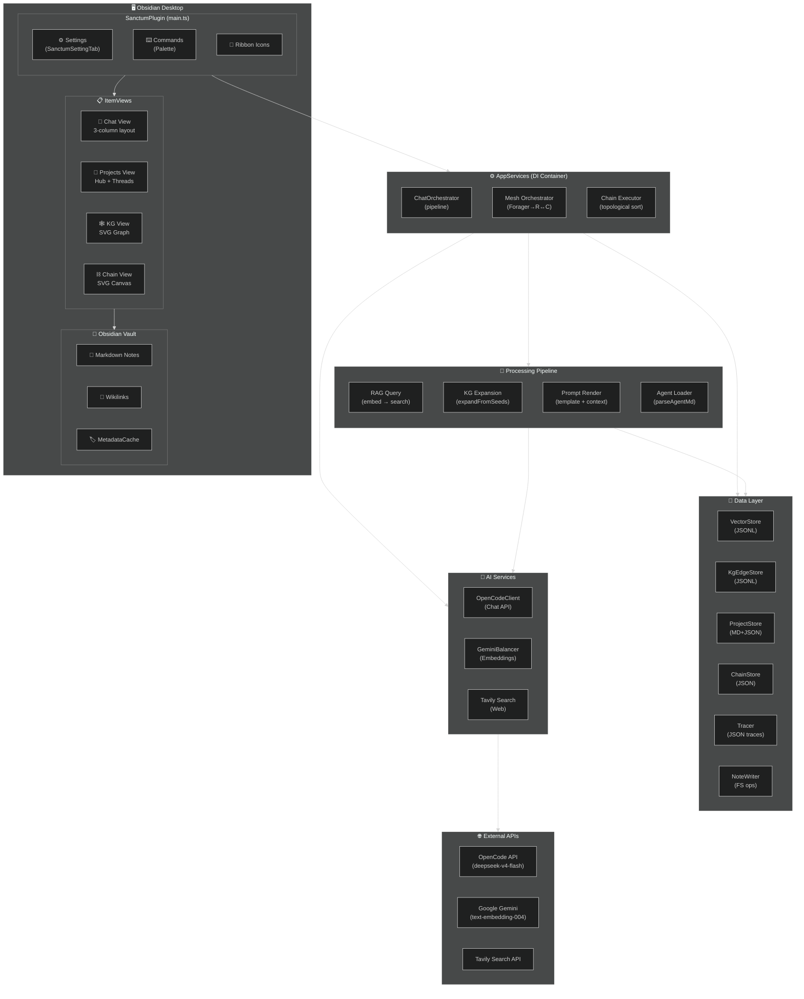

---

## 4. Diagrama de Secuencia — Flujo de Chat

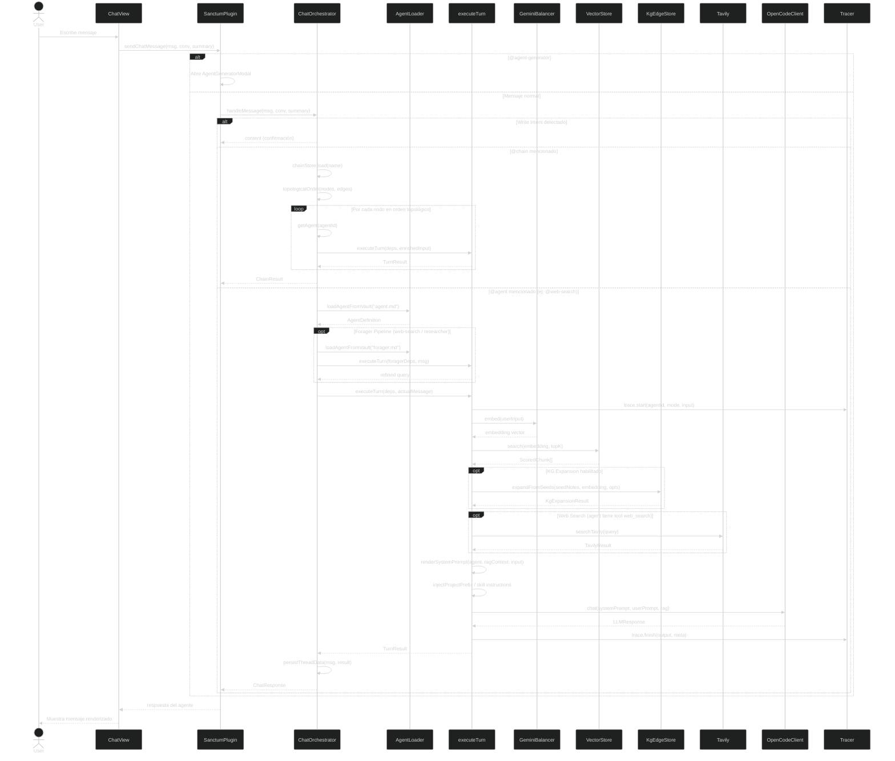

---

## 5. Diagrama de Secuencia — Mesh con Crítico

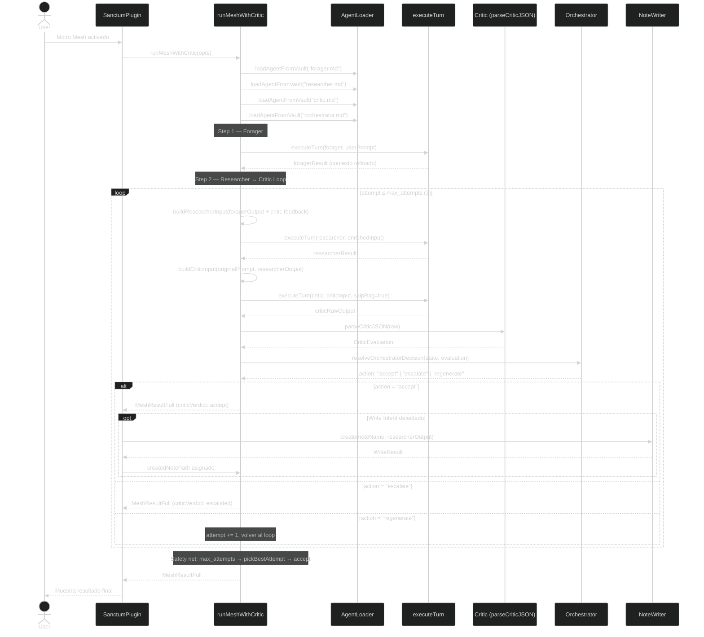

---

## 6. Diagrama de Secuencia — Ejecución de Cadenas

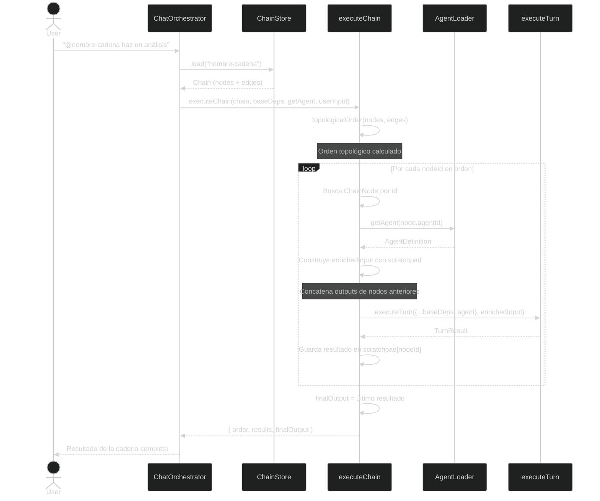

---

## 7. Diagrama de Estados — Ciclo Mesh

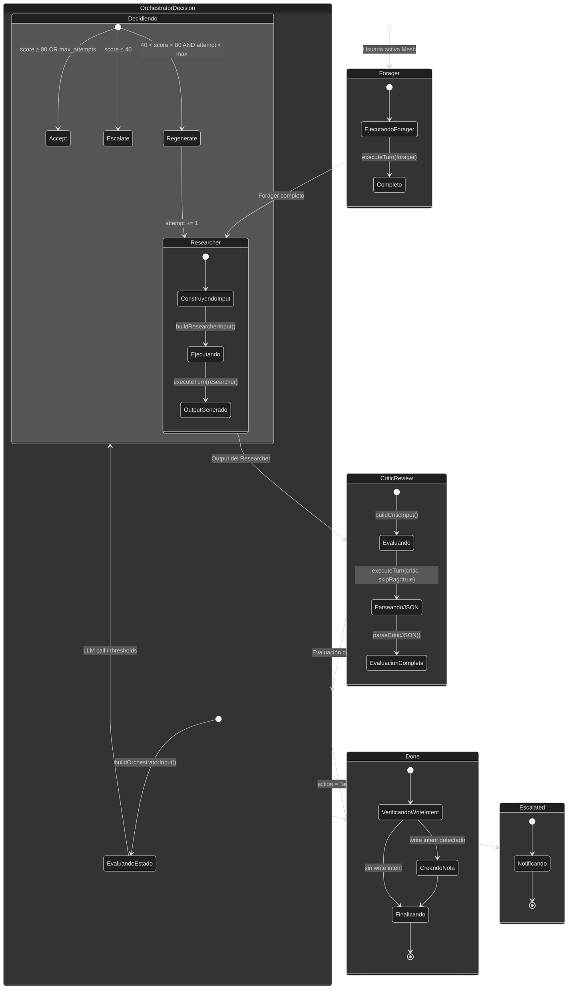

---

## 8. Diagrama Entidad-Relación (ER)

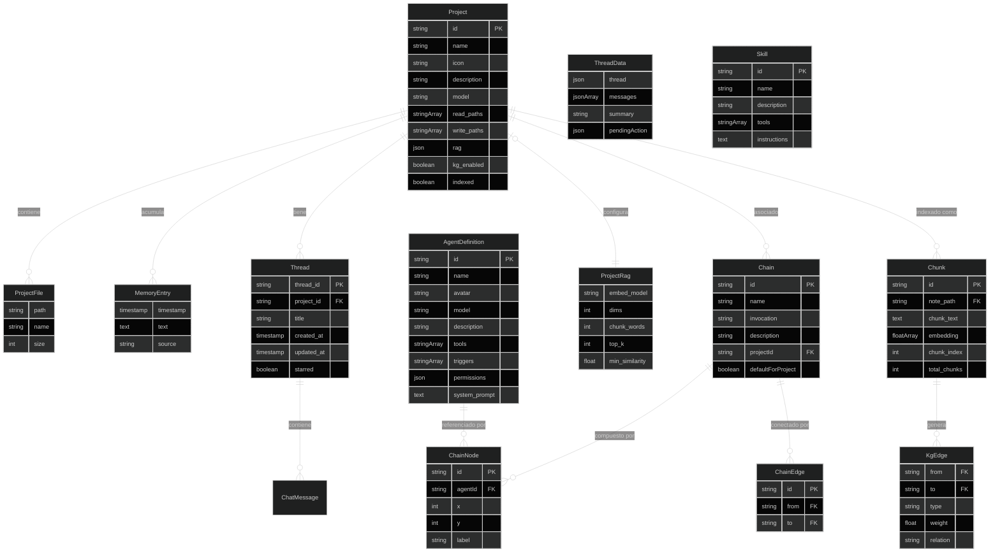

---

## 9. Diagrama de Despliegue (Deployment)

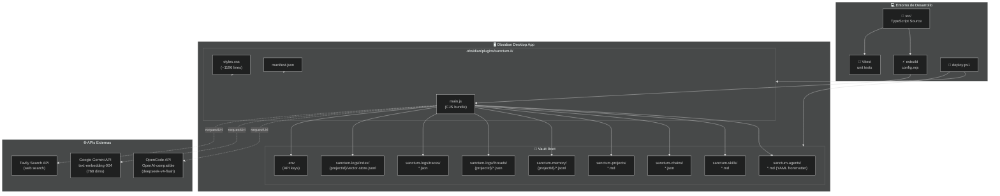

---

## 10. Resumen de Patrones Arquitectónicos

| Patrón | Implementación |
|---|---|
| **Dependency Injection** | `AppServices` actúa como contenedor DI central. `SanctumPlugin` inyecta todas las dependencias en `Object.assign()`. |
| **Plugin como Facade** | `SanctumPlugin` expone todos los servicios y delega en `ChatOrchestrator` y `runMeshWithCritic()`. |
| **Pipeline** | `executeTurn()` implementa RAG → KG → Web → Prompt → LLM como pipeline secuencial. |
| **Observer (Eventos)** | `app.vault.on("modify")` y `app.vault.on("delete")` para actualización reactiva del KG. |
| **Strategy** | Modos de layout del KG: `forceLayout` vs `convolutionalLayout`. |
| **Append-Only Log** | `VectorStore` y `KgEdgeStore` usan JSONL con append incremental. |
| **Template Method** | `renderSystemPrompt()` sustituye `{{rag_context}}`, `{{user_prompt}}`, `{{web_context}}`. |
| **Topological Sort** | `executeChain()` ordena nodos DAG antes de ejecución secuencial con scratchpad. |
| **Multi-Agent Mesh** | Forager → Researcher ↔ Critic con Orchestrator como router de decisiones. |
| **Permission Model** | Filtro de paths en dos capas: `project.read_paths` ∩ `agent.permissions.read_paths`. |

---

*Documento generado automáticamente desde el código fuente de Sanctum II. Todos los diagramas usan sintaxis Mermaid.*
