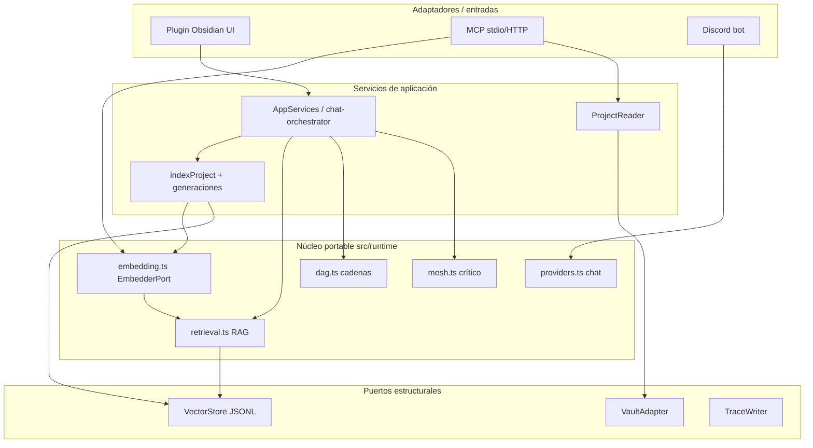
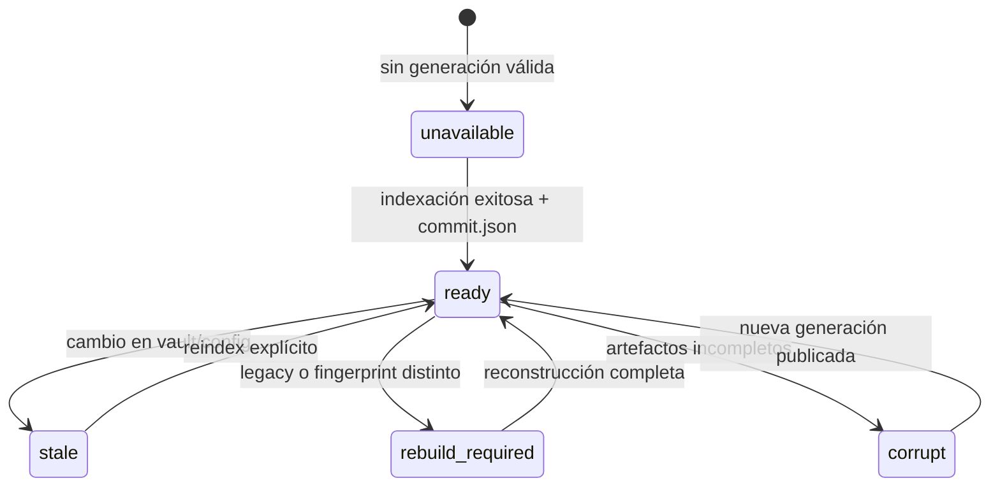
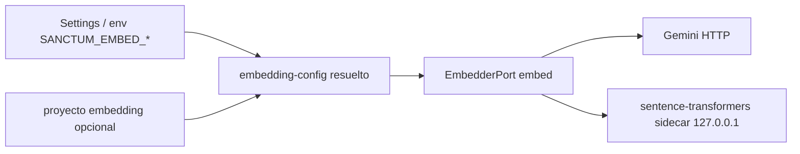
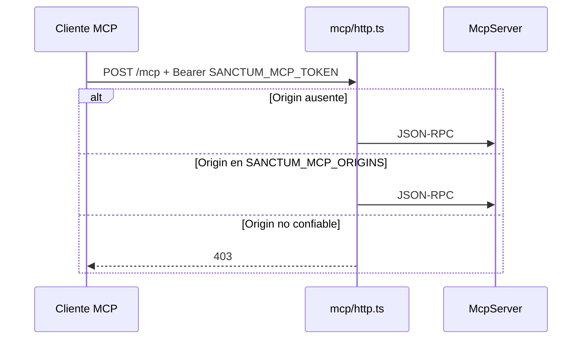

# Arquitectura UML — Sanctum II (runtime portable)

Diagramas de referencia alineados con **DEC-0022** (núcleo portable) y **DEC-0023** (embeddings locales opcionales). No inventan módulos fuera del repositorio.

## Capas

```mermaid
flowchart TB
  subgraph adapters [Adaptadores / entradas]
    ObsidianUI[Plugin Obsidian UI]
    MCP[MCP stdio/HTTP]
    Discord[Discord bot]
  end

  subgraph app [Servicios de aplicación]
    AppServices[AppServices / chat-orchestrator]
    ProjectReader[ProjectReader]
    Indexer[indexProject + generaciones]
  end

  subgraph runtime [Núcleo portable src/runtime]
    DAG[dag.ts cadenas]
    Mesh[mesh.ts crítico]
    Retrieval[retrieval.ts RAG]
    EmbeddingPort[embedding.ts EmbedderPort]
    Providers[providers.ts chat]
  end

  subgraph ports [Puertos estructurales]
    Vault[VaultAdapter]
    VectorStore[VectorStore JSONL]
    Trace[TraceWriter]
  end

  ObsidianUI --> AppServices
  MCP --> ProjectReader
  MCP --> EmbeddingPort
  Discord --> Providers

  AppServices --> Mesh
  AppServices --> DAG
  AppServices --> Retrieval
  AppServices --> Indexer
  ProjectReader --> Vault
  Indexer --> VectorStore
  Retrieval --> VectorStore
  EmbeddingPort --> Retrieval
  Indexer --> EmbeddingPort
```

## Generaciones de índice por proyecto

```mermaid
stateDiagram-v2
  [*] --> unavailable: sin generación válida
  unavailable --> ready: indexación exitosa + commit.json
  ready --> stale: cambio en vault/config
  stale --> ready: reindex explícito
  ready --> rebuild_required: legacy o fingerprint distinto
  rebuild_required --> ready: reconstrucción completa
  ready --> corrupt: artefactos incompletos
  corrupt --> ready: nueva generación publicada
```

Artefactos inmutables bajo `sanctum-logs/index/{projectId}/generations/{generationId}/`:

- `metadata.json`, `manifest.json`, `vector-store.jsonl`, `kg-edges.jsonl`, `commit.json`

El MCP **refresca** la generación activa en cada `sanctum_query_vault`; no mantiene un índice global heredado.

## Embedder compartido (plugin + MCP)

```mermaid
flowchart LR
  Settings[Settings / env SANCTUM_EMBED_*]
  ProjectYAML[proyecto embedding opcional]
  Config[embedding-config resuelto]
  Port[EmbedderPort embed]
  Gemini[Gemini HTTP]
  Local[sentence-transformers sidecar 127.0.0.1]

  Settings --> Config
  ProjectYAML --> Config
  Config --> Port
  Port --> Gemini
  Port --> Local
```

- Default: **Gemini** (`GEMINI_API_KEYS`).
- Local: servicio Python **manual**, token en loopback, sin fallback remoto si falla.
- Identidad de vector (backend, modelo, revisión, dims, fingerprint) se sella en la generación.

## MCP HTTP (loopback)

```mermaid
sequenceDiagram
  participant Client as Cliente MCP
  participant HTTP as mcp/http.ts
  participant S as McpServer

  Client->>HTTP: POST /mcp + Bearer SANCTUM_MCP_TOKEN
  alt Origin ausente
    HTTP->>S: JSON-RPC
  else Origin en SANCTUM_MCP_ORIGINS
    HTTP->>S: JSON-RPC
  else Origin no confiable
    HTTP-->>Client: 403
  end
```

## Cadenas y mesh

| Flujo | Módulo | Contrato |
|---|---|---|
| Cadenas visuales / chat | `runtime/dag.ts` + `chains/executor.ts` | DAG validado, sin ciclos; contexto solo de predecesores directos |
| Mesh investigación | `runtime/mesh.ts` | Mejor intento por score; `accepted` exige umbral + verdict accept |

## Verificación documentada

- Vitest: `src/**/*.test.ts`, `mcp-server/**/*.test.ts`
- KG: `npm run test:kg` (tsx)
- Orquestación dev: `orchestration/tests/Run-OrchestrationTests.ps1`
- Auditoría 2026-10-08: `docs/audits/2026-10-08/reproduce.test.ts` (contratos DEC-0022)
- CI: Windows + Linux, `npm run verify` sin secretos ni descarga de modelos

Validación **Obsidian Desktop** en vault de producción: pendiente; no usar estos diagramas como evidencia de release en Community Plugins.
