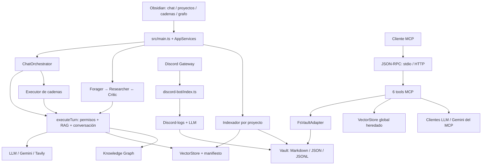

# Mapeo y auditoría general de Sanctum II

Fecha local: 8 de octubre de 2026 (Costa Rica). Base: `main`, commit `eafef22`.

**Diagnóstico:** MVP con una separación de módulos útil, persistencia inspeccionable y pruebas de regresión relevantes. La integración entre superficies, los límites de lectura durante la indexación y la durabilidad bajo concurrencia necesitan correcciones. La suite habitual pasa, pero el comando completo de verificación falla en Windows y las reproducciones adicionales exponen contratos sin protección.

## Qué hace

Sanctum II convierte un vault de Obsidian en un espacio de trabajo con IA: conversaciones persistentes por proyecto, recuperación semántica de notas, investigación con agentes, generación/actualización de Markdown, memoria, grafo de conocimiento y cadenas configurables.

Tiene tres entradas ejecutables:

1. **Plugin de Obsidian Desktop:** UI de chat, proyectos, grafo y cadenas. Compila a `main.js`.
2. **Servidor MCP:** Node por stdio o HTTP local. Compila a `mcp-server/dist/index.cjs`. Expone **seis** tools: listar agentes, listar notas, leer nota, consultar índice, invocar agente y ejecutar mesh. El README principal todavía habla de cinco.
3. **Bot de Discord:** proceso independiente con `discord.js`, allowlist de servidor/canales, historial Markdown en `Discord-logs/`, llamadas a Grok/OpenCode y respuesta en el canal. No es un cliente del MCP en el código actual.

El almacenamiento es local; la inferencia y los embeddings usan servicios externos. El plugin tiene transporte compatible con OpenAI y Anthropic, Gemini para embeddings y Tavily para web. El bot añade la opción xAI. El MCP tiene sus propios adaptadores HTTP de chat y embeddings.

## Arquitectura observada

Es una aplicación TypeScript modular con varios puntos de entrada y un núcleo parcialmente compartido. No necesita base de datos externa. Usa adaptadores estructurales para trabajar tanto con el vault de Obsidian como con el filesystem de Node. `AppServices` concentra dependencias y estado mutable de la sesión.



| Área | Archivos/directorios | Responsabilidad real |
|---|---|---|
| Arranque e integración | `src/main.ts`, `src/app/services.ts` | Settings, clientes, vistas, eventos del vault, proyecto activo y cachés de índices. |
| Coordinación del chat | `src/app/chat-orchestrator.ts` | Captura contexto de solicitud, resuelve menciones, cadenas, acciones pendientes, intención de escritura y persistencia. |
| Ejecución de agentes | `src/orchestrator/` | RAG, web, historial/resumen, mesh con crítico, resolución de referencias y generación de notas. |
| Proyectos | `src/projects/` | Definiciones Markdown, threads JSON, memoria JSONL e indexación incremental. |
| Recuperación | `src/rag/`, `src/embeddings/` | Vectores en memoria, log JSONL de operaciones, similitud coseno y rotación/fallback de Gemini. |
| Grafo | `src/kg/` | Aristas explícitas de wikilinks, similitud entre centroides, expansión de contexto y layout. |
| Extensiones declarativas | `src/agents/`, `src/skills/`, `sanctum-agents/`, `sanctum-skills/` | YAML + Markdown, validación, carga, autoría y prompts. |
| Cadenas | `src/chains/` | Persistencia del grafo y ejecución secuencial según un orden calculado. |
| UI | `src/ui/` | DOM y componentes de Obsidian; no usa React. |
| Escritura y observabilidad | `src/core/`, `src/observability/` | Adaptador del vault, creación de directorios/notas y trazas locales. |
| Integración MCP | `mcp-server/` | Servidor JSON-RPC, transporte, permisos, filesystem protegido y tools. |
| Discord | `discord-bot/`, `src/discord/` | Gateway, cola por canal, historial, composición de requests y respuestas. |
| Automatización del desarrollo | `orchestration/`, `docs/contracts/`, `docs/design/` | Tareas, worktrees, roles y decisiones de ingeniería. Es distinto del mesh de agentes del producto. |

El recorrido habitual de un turno es: capturar proyecto/thread/agente → resolver acción pendiente o mención → recuperar fragmentos permitidos → añadir memoria, historial y skill → llamar al LLM → devolver respuesta y persistir estado/traza. El mesh repite la etapa Researcher/Critic; las cadenas invocan varios turnos.

Persistencia principal: `sanctum-projects/*.md`, `sanctum-logs/threads/<proyecto>/*.json`, `sanctum-memory/<proyecto>/memory.jsonl`, `sanctum-logs/index/<proyecto>/{vector-store.jsonl,manifest.json,kg-edges.jsonl}`, `sanctum-logs/traces/*.json` y `sanctum-chains/`. El MCP consulta actualmente el índice global `sanctum-logs/vector-store.jsonl`.

## Evidencia ejecutada

Entorno: Windows, Node `22.22.2`, npm `10.9.7`. Tras el pull faltaba `discord.js` en `node_modules`; se sincronizó el lockfile con `npm ci --ignore-scripts --no-audit --no-fund`. El primer intento de Vitest dentro del sandbox no llegó a ejecutar tests por `EPERM` en temporales. Estos incidentes de entorno no se cuentan como bugs del producto.

| Verificación | Resultado |
|---|---|
| `npm run typecheck` | Pasa tras sincronizar dependencias. |
| Suite incluida en `npm run verify` | **217/217 tests, 25 archivos**, pasan. |
| `npm run build` | Pasa para plugin y MCP. Los bundles preexistentes se restauraron byte por byte después de probar. |
| Smoke MCP con claves vacías y vault apuntando al checkout | **17/18 comprobaciones**. Falla el catálogo de agentes con archivos CRLF. |
| `npm run verify` completo | **Falla** por el smoke anterior. |
| `node --import tsx src/kg/kg.test.ts` | **46 comprobaciones** pasan. Está excluido del Vitest habitual. |
| `powershell -NoProfile -ExecutionPolicy Bypass -File orchestration/tests/Run-OrchestrationTests.ps1` | Pasa. Crea repositorios temporales propios y los limpia. |
| `npm run mcp:http` | Falla en Windows: `SANCTUM_MCP_HTTP` no se reconoce como comando. |
| Reproducciones adicionales | **12/12 casos fallan contra el contrato esperado**, confirmando los comportamientos descritos abajo. |

Evidencia: [verify.log](verify.log), [kg.log](kg.log), [orchestration.log](orchestration.log), [resultados originales de Vitest](baseline-results.json), [reproducciones](reproduce.test.ts), [resultados de las reproducciones](reproduce-results.json).

Para repetir las reproducciones desde la raíz:

```powershell
npx --no-install vitest run --config docs/audits/2026-10-08/vitest.config.ts
```

Estas pruebas expresan el comportamiento deseado; se espera que fallen en `eafef22`. Están fuera de la suite por defecto. Usan archivos sintéticos y dobles explícitos de Gemini, LLM y Obsidian; la única conexión de red de las reproducciones es a un servidor temporal de localhost. No prueban la calidad de respuestas de proveedores reales.

## Hallazgos reproducidos y prioridades

### 1. P1 — El indexador lee y genera embeddings con permisos vacíos (A1)

En `src/projects/indexer.ts:98`, `read_paths: []` se sustituye por `Research`. La prueba crea una nota sintética allí, pasa permisos vacíos y observa **una llamada a embed**, cuando debería haber cero. El flujo de consulta sí tiene filtros, pero este procesamiento previo ya utiliza contenido fuera del ámbito declarado.

**Mejora:** permisos vacíos deben producir cero lecturas y cero solicitudes externas; separar explícitamente la asignación de defaults durante la creación de proyectos de la aplicación de permisos durante ejecución. Añadir el caso al contrato de indexación.

### 2. P1 — Frontmatter con CRLF rompe la carga de agentes (A11 + smoke)

`src/shared/agents/frontmatter.ts:20` extrae YAML conservando un `\r` final aislado. El parser YAML lo rechaza cuando el último valor es una secuencia. El mismo documento con LF pasa y con CRLF falla. `mcp-server/src/tools/list-agents.ts:25` repite la extracción.

En este checkout el MCP anuncia solo dos agentes; Forager, Researcher, Critic y otros se omiten con `YAMLParseError`. Por eso falla el smoke. El cargador común también está afectado; no se comprobó el síntoma dentro de Obsidian.

**Mejora:** normalizar saltos de línea en la frontera de lectura y reutilizar un extractor común; probar LF/CRLF y ejecutar CI también en Windows. El error de permisos observado por el smoke puede ser consecuencia de un YAML ilegible y no demuestra que el agente se haya cargado correctamente.

### 3. P1 — HTTP no valida Origin (A10)

`mcp-server/src/mcp/http.ts:6` descarta expresamente la validación porque escucha en localhost. Un POST con `Origin: https://untrusted.example`, cuerpo JSON y content-type `text/plain` obtiene **200** sin token. Se verificó con `ping`, sin acceder a datos privados.

La [especificación MCP 2025-03-26](https://modelcontextprotocol.io/specification/2025-03-26/basic/transports) exige validar Origin también para proteger servidores locales; limitar el bind a loopback es una protección adicional. La reproducción demuestra aceptación del origen, no una explotación completa desde navegador.

**Mejora:** validar Origin antes de despachar, establecer una política explícita para clientes sin Origin y proteger llamadas mediante autenticación. Mantener las pruebas de tamaño de cuerpo y token ya existentes.

### 4. P1 — MCP y plugin no comparten el índice de proyecto (A4)

`src/main.ts:457` crea índices por proyecto. `mcp-server/index.ts:34` construye `new VectorStore()` con la ruta global heredada. Al indexar una nota para un proyecto, el store del plugin tiene **1 chunk** y la construcción usada por MCP carga **0**. La configuración por defecto del plugin habilita proyectos.

**Mejora:** seleccionar proyecto explícitamente en MCP y compartir la resolución de rutas/contrato de índices. Añadir una prueba de integración «indexar en plugin → consultar por MCP». El MCP carga el índice al inicio, por lo que también necesita definir cómo refresca cambios posteriores.

### 5. P2 — La indexación omite carpetas anidadas e ignora cambios de configuración (A2, A3)

`src/projects/indexer.ts:112` procesa `listing.files`, pero no recorre `listing.folders`. Con `Research/root.md` y `Research/child/nested.md`, solo se indexa la primera. El doble de filesystem de `src/projects/indexer.test.ts` devuelve descendientes como si fueran archivos directos, lo que oculta este hueco.

El manifiesto en `indexer.ts:141` depende solo del contenido: cambiar `chunk_words` de 6 a 2 conserva **1 chunk**, cuando el mismo texto debe producir **3**.

**Mejora:** enumeración recursiva dentro de los límites autorizados; dobles que respeten el contrato real de `list`; fingerprint del indexado que incluya contenido, modelo, dimensiones y chunking, con reconstrucción explícita al cambiarlo.

### 6. P2 — Pérdida de datos con operaciones superpuestas (A6, A7)

`src/projects/store.ts:207` implementa append de memoria como read-modify-write sin lock. Dos llamadas concurrentes dejan únicamente **la segunda entrada**. Los locks existentes protegen threads, no esta memoria.

`src/rag/vector-store.ts:183` vacía toda la cola al terminar un append. Si se añade otro chunk mientras ese append espera I/O, su operación también se borra de la cola. Tras un segundo save y recarga hay **1 chunk en disco frente a 2 en memoria**. Esta es una reproducción del contrato de almacenamiento; no se demostró que el indexador habitual dispare esa intercalación, pues tiene deduplicación por proyecto.

**Mejora:** serializar operaciones por recurso; persistir y retirar solo el lote capturado, conservando operaciones nuevas y restaurando el lote ante error. Probar solapamiento, error de I/O y reapertura del store.

### 7. P2 — Las cadenas no garantizan semántica de grafo dirigido (A8, A9)

`src/chains/executor.ts:14` añade los nodos no visitados al final; un ciclo `A → B → A` se acepta. En `executor.ts:57` cada nodo recibe todo el scratchpad, incluidos outputs de nodos desconectados. La segunda reproducción confirma ese traspaso. El código declara contexto acumulado, por lo que conviene decidir formalmente si el producto promete un pipeline global o un DAG con dependencias; el canvas y la documentación sugieren lo segundo.

**Mejora:** rechazar ciclos/referencias inválidas y definir qué predecesores aportan contexto. Usar esas mismas reglas tanto desde chat como desde el editor visual. No se probó aquí la interacción del canvas.

### 8. P2 — El mesh MCP puede entregar un intento peor como aceptado (A12)

`mcp-server/src/tools/run-mesh.ts:120` sobrescribe `bestOutput` en cada vuelta, antes de compararlo. Con scores sintéticos **60 → 50**, termina por falta de mejora y conserva `WORSE_ATTEMPT`. Además, su estado es `accepted` aun con umbral 80. El anuncio del argumento threshold promete regenerar o escalar por debajo del mínimo.

**Mejora:** conservar la pareja output/score del mejor intento, separar «terminó» de «superó el umbral» y compartir la máquina de estados con el mesh del plugin. Añadir pruebas deterministas de mejora, regresión, rechazo y agotamiento de intentos.

### 9. P2 — Script HTTP no portable

El script `mcp:http` de `package.json` usa asignación de variable propia de shells POSIX. En Windows falla antes de arrancar el servidor; la CI actual corre únicamente en Ubuntu.

**Mejora:** un punto de entrada Node que configure la variable o argumentos de CLI portables; probar el arranque y cierre en Windows y Linux.

## Otras debilidades observadas por inspección

Estas observaciones no son mediciones de rendimiento ni fallos end-to-end reproducidos:

- **Concentración de responsabilidades.** `projects-view.ts` tiene 749 líneas, `main.ts` 675, `chain-view.ts` 503, `chat-orchestrator.ts` 483 y `kg-view.ts` 478. La UI, coordinación y estado comparten archivos grandes; parte del contrato de seams menciona splits que no están en el árbol actual. Extraer servicios de sesión/proyecto e indexación facilitaría pruebas sin cargar Obsidian.
- **Configuración que no llega al ejecutor.** `AgentDefinition.model` y `Project.model` se cargan/muestran, pero el turno usa el cliente construido con `settings.llmModel`. `rag.embed_model` y `rag.dims` se serializan, mientras el adaptador usa su lista fija y 768 dimensiones. Conviene aplicar estos campos o dejar claro que son descriptivos.
- **Fallback de embeddings sin identidad persistida.** Los clientes pueden alternar modelos, pero cada chunk guarda vector y texto sin modelo/versión. Igual longitud no garantiza igual espacio semántico. Falta una política verificable para reconstruir índices cuando cambia el modelo; no se compararon embeddings reales en esta auditoría.
- **Escalabilidad.** `VectorStore.search` calcula coseno sobre todos los chunks y ordena todos los resultados; el KG compara pares de notas. Costes aproximados: `O(C·D + C log C)` para búsqueda y `O(N²·D)` para las aristas semánticas, aparte de construir centroides. No se midió latencia en un vault grande. Primero medir; después considerar selección top-k, trabajo en background y actualizaciones incrementales.
- **Actualización del índice.** Los eventos modify/delete en `main.ts` actualizan aristas, pero no regeneran/eliminan automáticamente los chunks del RAG; rename tampoco tiene un manejador equivalente. La frescura depende del reindexado. Hace falta documentarla y protegerla con pruebas de ciclo de vida.
- **Divergencia entre superficies.** El MCP comparte parsing y algunas utilidades, pero duplica la política del mesh y no aplica contexto de proyecto como el plugin. Invocar un agente o mesh por MCP solo inyecta el texto `context` que envía el cliente; no recupera RAG automáticamente.
- **Calidad de la verificación.** El KG y la orquestación pasan por separado, pero no están en `npm run verify`. El smoke no aísla un vault fixture ni limpia por sí solo credenciales heredadas. Sus cinco comprobaciones de formato de traza escriben un objeto construido por el propio test, sin ejercitar `TraceWriter`.
- **Documentación rezagada.** El README no refleja las seis tools, HTTP y Discord con el mismo detalle que el código. Los documentos de arquitectura deberían distinguir lo implementado de los splits y contratos propuestos.

## Fortalezas que conviene conservar

- Adaptadores del vault y lógica pura compartida hacen posible probar una parte importante sin Obsidian.
- Hay regresiones sobre permisos, traversal/symlinks, escritura de notas, aislamiento conversacional y autoría, además de typecheck estricto.
- `FsVaultAdapter` rechaza rutas absolutas, `..`, segmentos sensibles y escapes por symlink; la suite existente verifica estos límites.
- La captura de contexto al iniciar solicitudes reduce cruces entre proyectos/threads; existen locks de threads y deduplicación de indexación por proyecto.
- Markdown/JSONL permiten inspección y recuperación manual; los módulos compartidos de YAML, requests de chat y parsing del crítico reducen duplicación.

## Orden de mejora sugerido

1. Resolver permisos vacíos, carga CRLF y validación de Origin. Son límites de seguridad/funcionamiento básico, con reproducciones pequeñas.
2. Unificar resolución del índice de proyecto entre MCP/plugin, asegurar recursión e invalidación y corregir persistencia concurrente.
3. Formalizar contratos de cadenas y estados del mesh; preservar mejor intento y coherencia de scores.
4. Incluir Windows, KG y orquestación en verificación; convertir reproducciones corregidas en regresiones permanentes y crear smoke con fixtures.
5. Separar servicios desde `main`/vistas, alinear configuración/documentación y medir rendimiento con tamaños representativos antes de cambiar almacenamiento.

## Alcance y límites

Se revisaron código, configuración, tests, scripts y documentos del checkout. El inventario de `src/`, `mcp-server/src/` y `discord-bot/` contiene 89 archivos TypeScript de producción (~12.093 líneas) y 26 archivos de prueba (~3.537 líneas); excluye el entrypoint raíz del MCP y otros tipos de archivo. Son dimensiones del código, no porcentajes de cobertura.

No se abrió Obsidian, no se inició el bot con credenciales, no se enviaron notas a proveedores ni se midió la calidad factual del LLM. Los scores del crítico son autoevaluación de otro modelo, no validación independiente de exactitud. No se corrigió código del producto: esta entrega añade únicamente documentación, evidencia y pruebas de auditoría fuera de la suite normal.
